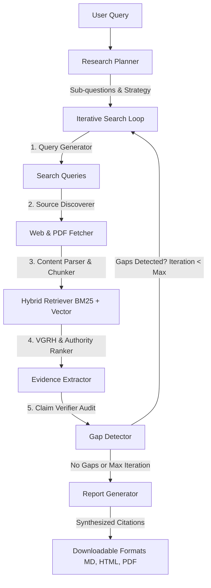

# Agentic Deep Research Engine 🚀

A complete, production-ready **Agentic Deep Research Engine** built for 48-hour hackathon submissions. This application runs on a FastAPI backend, retrieves real-time knowledge via Tavily or DuckDuckGo Search, evaluates sources using custom **VGRH scoring (Veracity, Grounding, Relevance, Helpfulness)**, checks and audits claims via LLM-assisted verification, and synthesizes a fully cited Markdown research report.

The system features a futuristic dark-mode glassmorphic single-page dashboard displaying real-time pipeline progress logs via Server-Sent Events (SSE).

---

## 🏗️ Architecture Explanation

The engine processes research queries through a step-by-step agentic pipeline:



### 1. Research Planner
Decomposes the primary research topic into 3-5 logical sub-questions.

### 2. Iterative Research Loop (Gap Detection)
Runs up to 2 iterations of discovery. After generating the initial set of evidence, the **Gap Detector** checks the status of each sub-question:
* Prompts the LLM: *"Given this research question and these sub-questions, which sub-questions have weak, missing, or low-confidence evidence? List them."*
* If gaps are found, it generates new search queries targeting only those gaps, fetches new sources, runs retrieval and ranking, merges new evidence, and regenerates the final output.

### 3. Hybrid Retrieval & Reciprocal Rank Fusion (RRF)
Fuses keyword matching and semantic search to find top candidates:
* **Keyword Matching**: Pre-filters chunks using BM25.
* **Semantic Search**: Computes local embeddings using the `sentence-transformers` library with model `all-MiniLM-L6-v2` and runs cosine similarity.
* **Reciprocal Rank Fusion**: Ranks chunks based on RRF: 
  $$\text{RRF Score} = \frac{1}{60 + \text{rank}_{\text{BM25}}} + \frac{1}{60 + \text{rank}_{\text{Vector}}}$$
  Fuses the top 15 candidate chunks and records the source method (`BM25`, `Vector`, or `Both`).

### 4. Source Authority Scoring & VGRH Ranker
Performs LLM-assisted evaluation scoring on a scale of 0.0 to 10.0 for four key metrics:
* **Veracity (30%)**: Consensus validity and truthfulness.
* **Grounding (25%)**: Level of empirical data, proof, or citation.
* **Relevance (30%)**: Match rate to the user's research topic.
* **Helpfulness (15%)**: Structural readability and depth.

**Domain Authority Scoring**:
* Identifies domain tiers (Academic, Government, News, General Web).
* Adjusts Veracity score: Government / Academic domains receive a **+0.1 boost**, while unknown/unverified domains receive a **-0.05 reduction**.
* Applies a **+0.15 corroboration confidence boost** to claims supported by 3 or more independent sources.

### 5. Evidence Extractor & Claim Verifier
* Mines top-ranked chunks for core claims and verbatim matching text snippets.
* Audits extracted claims against all retrieved materials, marking them as `supported`, `uncertain`, or `contradicted`.
* **Important**: Contradicted and uncertain claims are flagged with explanation notices, rather than being deleted, preserving transparency and limitations.

### 6. Report Generator
Synthesizes the final Markdown, HTML, and PDF reports including an Executive Summary, sub-question structure, Source Matrix (VGRH scores), Evidence Matrix, final cited prose (`[Source N]`), and Limitations.

---

## 📂 Project Structure

```
DeepResearchEngine/
├── main.py                    # FastAPI server entry point and endpoint routes
├── pipeline/                  # Modular agentic pipeline components
│   ├── __init__.py
│   ├── config.py              # Centralized configuration (limits, weights, model mappings)
│   ├── llm_client.py          # Groq/OpenAI client caller and mock fallbacks
│   ├── planner.py             # Research planner, query generator, and gap detector
│   ├── ranker.py              # VGRH evaluator and source authority scoring
│   ├── reporter.py            # Markdown report compilation & HTML/PDF exporters
│   ├── retriever.py           # Web discovery, PDF fetching, and BM25 + Vector hybrid RRF retriever
│   └── verifier.py            # Evidence claims extraction and verification auditing
├── templates/
│   └── index.html             # Single-page UI with stepper, plan cards, evidence filter grids
├── sample_output/             # Folder containing pre-run sample research documents
│   ├── evidence.json          # Pre-run extracted evidence structure
│   ├── report.md              # Pre-run synthesised Markdown report
│   └── report.html            # Pre-run synthesised HTML report
├── requirements.txt           # Virtual environment python packages list
└── README.md                  # Documentation
```

---

## 🛠️ Getting Started

### Prerequisites
* Python 3.11+
* Groq API Key (`GROQ_API_KEY`)
* Optional: Tavily API Key (`TAVILY_API_KEY`)

### Installation
1. Clone or copy this repository:
   ```bash
   cd DeepResearchEngine
   ```

2. Create a virtual environment and activate it:
   ```bash
   python -m venv venv
   # On Windows:
   .\venv\Scripts\activate
   # On macOS/Linux:
   source venv/bin/activate
   ```

3. Install required packages:
   ```bash
   pip install -r requirements.txt
   ```

4. Create your `.env` configuration file from the template:
   ```bash
   copy .env.example .env
   ```
   Open the `.env` file and insert your API keys:
   ```env
   GROQ_API_KEY=gsk_...
   TAVILY_API_KEY=tvly-...  # (Optional: If empty, DuckDuckGo Search will be used)
   ```

### Running the Server
Launch the FastAPI uvicorn server:
```bash
python main.py
```
By default, the dashboard is hosted at `http://127.0.0.1:8000`. Open this address in your web browser.

---

## 💻 UI & Stepper Timeline

The upgraded frontend dashboard features:
* **Example Chips**: Quick-clickable preset topics (e.g. *"Classroom air quality"*) to quickly test the pipeline.
* **11-Stage Progress Stepper**: Shows live pipeline execution stages, icons, state (pending, active, completed, failed), and time elapsed for each.
* **Research Plan Cards**: Displays the formulated sub-questions and highlights active statuses (Pending, Searching, Answered, Gap) as the loop runs.
* **Filterable Evidence Cards**: Displays claims with confidence gauges, authority badges, and collapsible source context blocks. Users can filter by status: *All*, *Supported*, *Uncertain*, and *Contradicted*.
* **Export Buttons**: Instantly download compiled `.md` (Markdown), `.html` (Self-contained page), and `.pdf` documents.

---

## ⚠️ Fallbacks & Safe Execution

1. **PDF Exporter Fallback**:
   WeasyPrint requires GTK+ libraries to be installed on Windows. If WeasyPrint cannot load on your system (e.g. missing `gobject-2.0-0`), the application detects this gracefully, logging a warning, and enabling a fallback warning in the UI:
   > *"WeasyPrint is not installed or available on this system. Please use the 'HTML' export button and print to PDF via your web browser (Ctrl+P)."*

2. **Offline / Demo Mode Fallback**:
   If the Groq API key is missing or invalid, the engine runs in Demo Mode, serving mock responses to showcase the layout, stepper timeline, and interactive widgets.

3. **DuckDuckGo Rate Limits**:
   If Tavily API key is not supplied, DuckDuckGo searches are run sequentially with a small delay. Running many concurrent searches might result in temporary IP bans by DuckDuckGo.
